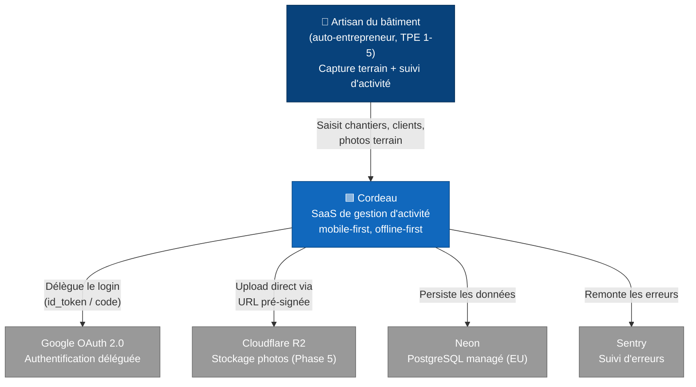
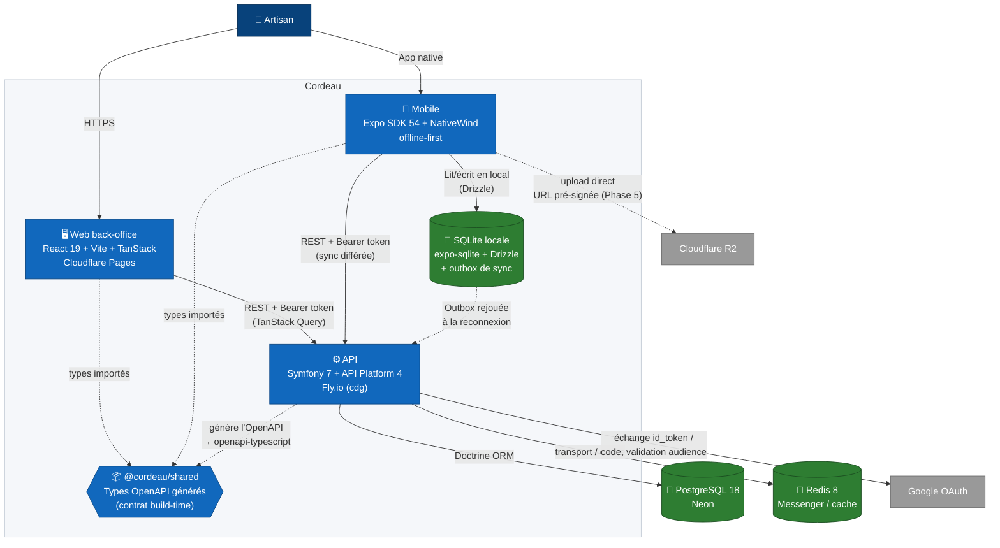
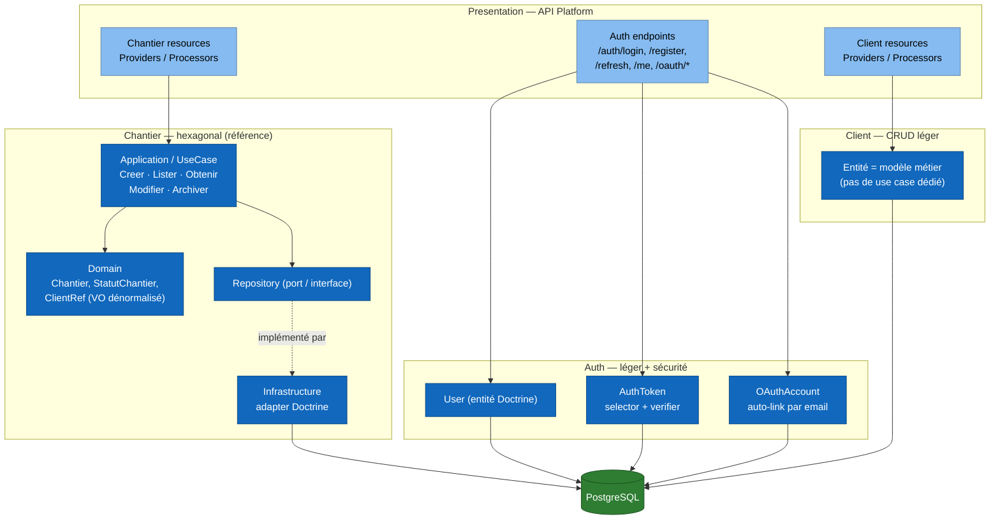
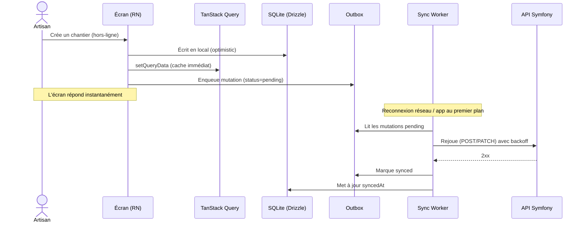

# Architecture Cordeau — vue d'ensemble

> **Document vivant.** Contrairement aux [ADRs](adr/README.md) (décisions datées et immuables), ce fichier décrit l'**état courant** de l'architecture et évolue avec le code. À mettre à jour en fin de phase, au même rythme que `CLAUDE.md` et les memories Serena.
>
> Convention de diagrammes : [ADR 0018](adr/0018-documentation-architecture-as-code.md). Les diagrammes suivent le [modèle C4](https://c4model.com/) (Context → Container → Component) en Mermaid `flowchart` versionné. Ils se rendent nativement dans GitHub et Notion.

Dernière mise à jour : 2026-05-28 (fin Phase 4, avant Phase 5 Photos/R2).

---

## Niveau 1 — Contexte système

Qui utilise Cordeau et avec quels systèmes externes le produit dialogue.

---

## Niveau 2 — Conteneurs

Les briques déployables qui composent Cordeau et leurs protocoles de communication.

> **Contrat de type partagé** : l'API est la source de vérité du schéma. `bin/console api:openapi:export` produit l'OpenAPI, `openapi-typescript` le transforme en `api.generated.ts`, importé par web et mobile. Toute dérive de contrat casse le `type-check` côté clients — c'est volontaire.

---

## Niveau 3 — Composants de l'API (bounded contexts)

L'API applique une [architecture hexagonale pragmatique](adr/0002-architecture-hexagonale.md) : rigueur sur les contextes complexes, légèreté sur les CRUD simples.

> **Règle de dépendance** : les flèches pointent vers l'intérieur. `Domain/` n'importe ni Doctrine ni Symfony. Cette règle est **vérifiée mécaniquement par Deptrac** en CI ([`apps/api/deptrac.yaml`](../apps/api/deptrac.yaml)) : toute fuite framework dans `Domain/`/`Application/`/`Shared/` casse le build — cf [ADR 0018](adr/0018-documentation-architecture-as-code.md). Les CRUD légers (Auth, Client) sont hors périmètre par design.

---

## Niveau 3 — Flux offline-first (mobile)

Le différenciateur V1 : la saisie terrain ne dépend jamais du réseau. Voir [ADR 0005](adr/0005-offline-first-sqlite-drizzle.md) et [ADR 0012](adr/0012-offline-first-query-pattern.md).

---

## Maturité par conteneur (Phase 4)

| Conteneur | Statut | Périmètre actuel |
|---|---|---|
| **API** | MVP | Auth (email + Google OAuth), Chantier (hexagonal complet), Client (CRUD léger), déployée Fly.io + Neon |
| **Web** | MVP | Login/register, CRUD chantiers + clients, garde de route, Sentry, Cloudflare Pages |
| **Mobile** | MVP + offline | Login/register, CRUD chantiers + clients, SQLite + outbox + sync worker, Google Sign-In, EAS |
| **Shared** | Outillage | Génération OpenAPI → TS opérationnelle |

Prochaines verticales (cf [ROADMAP.md](../ROADMAP.md)) : Phase 5 Photos/R2, Phase 6 Lots/Tâches, Phase 8 Devis/Facture.

---

## Comment mettre à jour ce document

1. Les diagrammes sont du Mermaid inline — éditer le bloc, prévisualiser dans l'aperçu Markdown de GitHub.
2. À chaque **fin de phase** : ajouter les nouveaux conteneurs/contextes, déplacer les éléments « (Phase N) » de prévision vers réel, dater l'en-tête.
3. Décision structurante derrière un changement de diagramme → un ADR **avant** la mise à jour ici. Ce document reflète, il ne décide pas.
